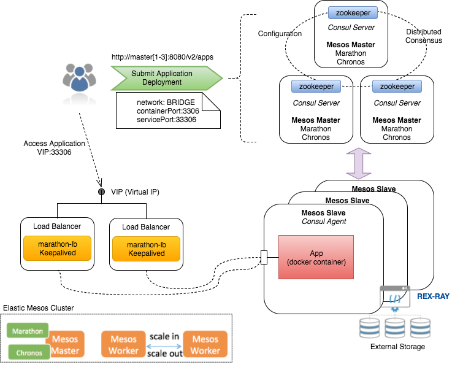

# Mesos Cluster 

The **INDIGO-DataCloud PaaS** relies on [Apache Mesos](http://mesos.apache.org/) for:
- managed service deployment 
- user applications execution

The instantiation of the high-available Mesos cluster is managed by the INDIGO *[Orchestrator](https://www.gitbook.com/book/indigo-dc/orchestrator/details)* in a fully automated way as soon as a user request described by a TOSCA template is submitted. Once the cluster is up and running, it can be re-used for successive requests.

**Mesos** is able to manage cluster resources (cpu, mem) providing isolation and sharing across distributed applications (frameworks)

**[Marathon](https://mesosphere.github.io/marathon/)** and **[Chronos](https://mesos.github.io/chronos/)** are two powerful frameworks that can be deployed on top of a Mesos Cluster.

Sophisticated two-level scheduling and efficient resource isolation are the key-features of the Mesos middleware that are exploited in the INDIGO PaaS, in order to run different workloads (long-running services, batch jobs, etc) on the same resources while preserving isolation and prioritizing their execution.

**INDIGO** *PaaS* uses:
- Marathon to deploy, monitor and scale *Long-Running services*, ensuring that they are always up and running.
- Chronos to run *user applications* (jobs), taking care of fetching input data, handling dependencies among jobs, rescheduling failed jobs.

## Features

- Automatic deployment through Ansible recipes embedded in TOSCA and HOT templates
  - All the services run in docker containers;
- High-availability of the cluster components: 
  - Leader election among master nodes managed by Zookeeper; 
  - HA Load-balancing;
-Service discovery through Consul that provides also DNS functionality and health checks; 
  - services are automatically registered in Consul as soon as they are deployed on the cluster
- The external access to the deployed services is ensured through load-balancers in HA (unique entrypoint: cluster Virtual IP)
- Cluster elasticity and application auto-scaling through CLUES plugin 

### INDIGO achievements
- [Ansible roles](#ansible-roles) and [TOSCA templates](https://github.com/indigo-dc/tosca-templates/blob/master/mesos_cluster.yaml) for cluster set-up featuring high-availability, service-discovery and load-balancing; 
- Integration with the INDIGO [Orchestrator](https://www.gitbook.com/book/indigo-dc/orchestrator/details) 
  - Job submission and service deployment requests are described through TOSCA templates
- Definition of custom TOSCA [types](https://github.com/indigo-dc/tosca-types/blob/master/custom_types.yaml#L506) for describing Chronos jobs and Marathon application  
- Cluster elasticity through [EC3/CLUES](https://github.com/indigo-dc/clues-indigo) plugin
- Zabbix monitoring [probes](https://github.com/indigo-dc/Monitoring) for Mesos, Marathon and Chronos;

## Components

The core components are:

- [Consul](http://consul.io) for service discovery
- [Mesos](http://mesos.apache.org) cluster manager for efficient resource isolation and sharing across distributed services
- [Chronos](https://mesos.github.io/chronos/) a distributed task scheduler
- [Marathon](https://mesosphere.github.io/marathon) for cluster management of long running containerized services
- [Docker](http://docker.io) container runtime
- [mesos-consul](https://github.com/CiscoCloud/mesos-consul) populating Consul service discovery with Mesos tasks
- [marathon-consul](https://github.com/CiscoCloud/marathon-consul) bridging Marathon information to Consul KV
- [haproxy-consul](https://github.com/CiscoCloud/haproxy-consul) for dynamic haproxy configuration using Consul

These components are distributed on the cluster nodes as shown in the diagram below.

- **Master nodes** 
  - On every master node the following (dockerized) components run: zookeeper, mesos master, consul server, marathon, chronos   
- **Slave nodes**
  - On every slave node the following (dockerized) components run: mesos slave, consul agent
- **Load-balancers**
  - On the two load-balancers the following (dockerized) components run: keepalived and haproxy-consul. keepalived ensures the high-availability of the load-balancer managing the cluster Virtual IP.

## Ansible roles

The following roles are available in Ansible Galaxy:

- indigo-dc.zookeeper: 
  - source: https://github.com/indigo-dc/ansible-role-zookeeper
- indigo-dc.consul:
  - source: https://github.com/indigo-dc/ansible-role-consul
- indigo-dc.mesos:
  - source: https://github.com/indigo-dc/ansible-role-mesos
- indigo-dc.chronos:
  - source: https://github.com/indigo-dc/ansible-role-chronos
- indigo-dc.marathon:
  -source: https://github.com/indigo-dc/ansible-role-marathon
- indigo-dc.haproxy-consul:
  - source: https://github.com/indigo-dc/ansible-role-haproxy-consul
- indigo-dc.keepalived:
  - source: https://github.com/indigo-dc/ansible-role-keepalived

These ansible roles can be installed through *ansible-galaxy* command: `ansible-galaxy install indigo-dc.rolename`

## Releases

| Release  | Component version |
| ------------- | ------------- |
| indigo_1  | Mesos 0.28.0   Marathon 1.1.1   Chronos 2.4.0 |
| indigo_2  | Mesos 1.1.0   Marathon 1.4.1   Chronos 3.0.2 |

## References
- **Apache mesos** 
  - Web site: http://mesos.apache.org/
  - Documentation: http://mesos.apache.org/documentation/latest/
  - Releases: http://mesos.apache.org/downloads/
  - Code repo: https://github.com/apache/mesos
  - Issue Tracker: https://issues.apache.org/jira/browse/MESOS

- **Marathon**
  - Web site: https://mesosphere.github.io/marathon/
  - Documentation: https://mesosphere.github.io/marathon/docs/
  - Releases: https://github.com/mesosphere/marathon/releases
  - Code repo: https://github.com/mesosphere/marathon
  - Issue Tracker: https://github.com/mesosphere/marathon/issues	

- **Chronos**
  - Web site: https://mesos.github.io/chronos/
  - Documentation: https://mesos.github.io/chronos/docs/
  - Releases: https://github.com/mesos/chronos/releases
  - Code repo: https://github.com/mesos/chronos
  - Issue tracker: https://github.com/mesos/chronos/issues

